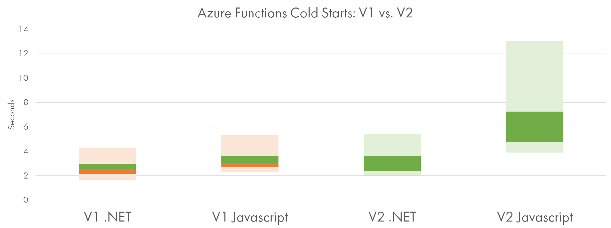
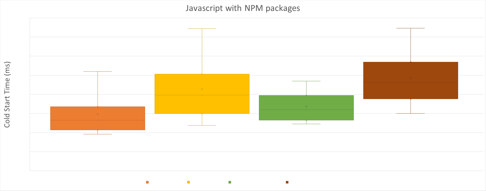
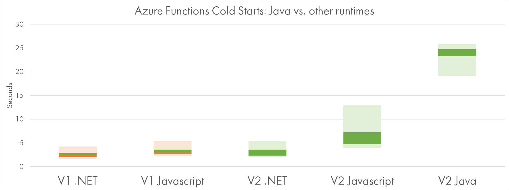
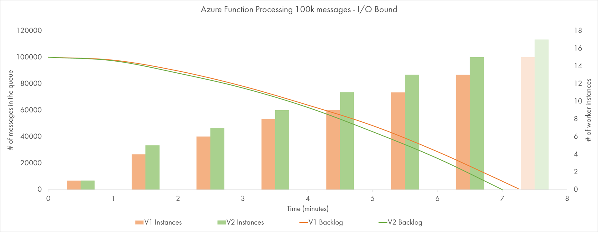
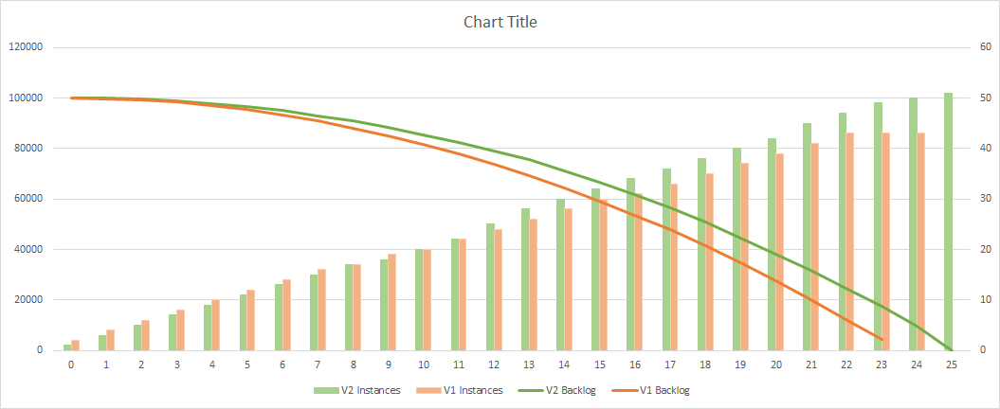

Azure Functions V2 was released into GA at a few days back at Microsoft Ignite. The runtime is now
based on .NET Standard, and thus is cross-platform and more interoperable.

In theory, .NET Core runtime is more lean and performant.
But last time [I checked back in April](https://mikhail.io/2018/04/azure-functions-cold-starts-in-numbers/),
the preview version of Azure Functions V2 had some serius issues with cold start durations.

I decided to give the new and shiny version another try and ran several benchmarks. TL;DR: it's not
perfect yet.

Cold Starts
-----------

Cold starts happen when a new instance handles its first request, see my other posts:
[one](https://mikhail.io/2018/04/azure-functions-cold-starts-in-numbers/),
[two](https://mikhail.io/2018/05/azure-functions-cold-starts-beyond-first-load/),
[three](https://mikhail.io/2018/08/serverless-cold-start-war/).

### Hello World

The following chart gives a comparison of V1 vs V2 cold starts for the two most popular runtimes,
.NET and Javascript (see [Reading Candle Charts](https://mikhail.io/2018/08/serverless-cold-start-war/#reading-candle-charts)
to understand the notation):

Apparently, V2 is slower to start for both runtimes. For .NET V2 is slower by 10% on average and seems 
to have higher variation. V2 on Javascript is massively slower: 2 times on average, and the slowest startup
time takes goes above 10 seconds.

### Dependencies On Board

The previous charts are calculated for Hello-World type of functions, with no extra dependencies.

The chart below shows two more Javascript functions, this time with a decent number of dependencies:

- "Deps" are referencing 3 NPM packages - 5MB zipped
- "Deps Max" are referencing 38 NPM packages - 35 MB zipped

V2 clealy looses on both samples, but the cold start time penalty seems to be consistently within 2.5-3
seconds for any amount of dependencies.

All the functions are deployed with Run-from-Package method which promises faster startup times.

### Java

Functions V2 come with a new generally-available runtime: JVM (Java). It utilizes the same extensibility
model as Javascript, and thus seems to be a first-class citizen now.

Cold starts are not first-class though: 

If you are a Java developer, be prepared to 20-25 seconds of initial startup time.

<blockquote class="twitter-tweet" data-conversation="none" data-dnt="true">
That matches some of our internal data. We are looking into it.
&mdash; Paul Batum (@paulbatum) <a href="https://twitter.com/paulbatum/status/1048391445386735616?ref_src=twsrc%5Etfw">October 6, 2018</a></blockquote> 

Queue Processor
---------------

Cold starts are mostly problematic for synchronous triggers like HTTP requests. They are less relevant
for queue-based workloads, where scale out is of more importance.

Last year I ran some tests around the ability of Functions to keep up with variable queue load:
[one](https://mikhail.io/2017/08/azure-functions-are-they-really-infinitely-scalable-and-elastic/),
[two](https://mikhail.io/2017/12/azure-functions-get-more-scalable-and-elastic/).

Today I ran two simple tests to compare the scalability of V1 vs. V2 runtimes.

### Pause-and-Go

In my first tests, a lightweight Javascript Function processes messages from an Azure Storage Queue. For
each message, it just pauses for 500 msec and then completes. This kind of simulates low-level I/O
based functions.

I've sent 100,000 messages to the queues and measured how fast they went away. Batch size (degree of parallelism
on each instance) was set to 16.

Two lines show the queue backlogs of two runtimes, while the bars indicate the amount of instances working
in parallel at a given minute.

We see that V2 was a bit faster to complete, probably due to more instances provisioned to it at any moment.
The difference is not big though, and might be statistically insignificant.

### CPU at Work

The Functions in my second experiment are CPU-bound. Each message invokes calculation of a 10-stage Bcrypt
hash. On a very quiet moment, 1 such function call takes about 300-400 ms to complete, with 100% CPU load on
the single core.

Both Functions are precompiled .NET and both are using [Bcrypt.NET](https://github.com/BcryptNet/bcrypt.net).

First thing to notice: it's the same number of messages with comparable "sequential" execution time, but 
the total time to complete the job increased 3-fold. That's because the workload is much more demanding to
the resources of application instances, and they struggle to parallelize work more aggressively.

Batch size (degree of parallelism on each instance) was set to 2 to avoid fighting for the same CPU. Yet, 
the average call duration is about 1.5 seconds (3x slower than possible).

V1 and V2 are again close to each other. One more time, V2 got more instances allocated to it most of the time.
And yet, it seemed to be *consistently* slower and lost about 2.5 minutes on 25 minutes interval (~10%).

