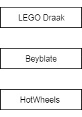
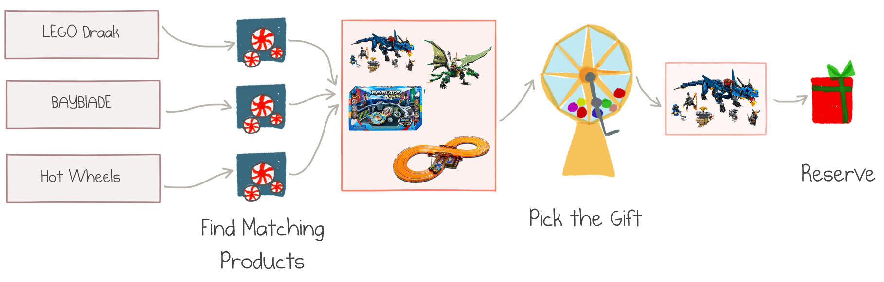
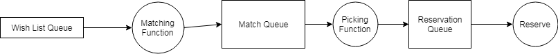

*The post is a part of 
[F# Advent Calendar 2018](https://sergeytihon.com/2018/10/22/f-advent-calendar-in-english-2018/).*

This summer I was hired by the office of Santa Claus. Santa is not just a lonely fairy tale
character&mdash;he leads a large organization that supplies gifts and happiness to millions of 
children around the globe. Like any large organization, Santa's office employs an impressive number of 
IT systems. 

As part of IT modernization
effort, they restructured the whole supply chain of Christmas gifts. Many legacy components were moved from
a self-managed data center at the North Pole&mdash;although the cooling is quite cheap there&mdash;to 
Azure cloud. Azure was an easy sell since Santa's techy elves use Office 365, SharePoint and
.NET development stack.

One of the goals of the redesign was to leverage managed cloud services and serverless architecture
whenever possible. Santa has no spare elves to keep reinventing the IT wheels.

Wish Fulfillment Service
------------------------

My assignment was to redesign the **Wish Fulfillment** service. The service receives
wish lists from clients (they call children "clients"):



<center class="img-caption">Christmas Wish List</center>

Luckily, the list is already parsed by some other service, and also contains the metadata about
the kid's background (age, gender, and so on) and preferences.

For each item in the list, our service calls the **Matching** service, which uses machine learning,
Azure Cognitive services, and a bit of magic to determine the actual products (they call gifts "products")
that best fit the expressed desire + kid's profile. For instance, my son's wish for "LEGO Draak" matches
to "LEGO NINJAGO Masters of Spinjitzu Firstbourne Red Dragon". You get the point.

There might be several matches for each desired item, and each result has an estimate of how
likely it is to fulfill the original request and make the child happy.

All the matching products are combined and sent over to **Gift Picking** service. Gift Picking selects one
of the options based on its price, demand, confidence level, and the Naughty-or-Nice score of the client.

The last step of the workflow is to **Reserve** the selected gift in the warehouse and shipping system
called "Santa's Archive of Products", also referred to as SAP.

Here is the whole flow in one picture:



<center class="img-caption">Gift Fulfillment Workflow</center>

How should we implement this service?

Original Design
---------------

The Wish Fulfillment service should run in the cloud and integrate with other services. It
should be able to process millions of requests in December and stay very cheap to run during the
low season. We decided to leverage serverless architecture with Azure Functions on Consumption Plan,
which provides a pay-per-request model.

Here is the diagram of the original design:



<center class="img-caption">Workflow Design with Azure Functions and Storage Queues</center>

We used Azure Storage Queues to keep the whole flow asynchronous and more resilient to failures
and fluctuation of the load.

This design would mostly work, but we found a couple of problems with it.

The functions were manually wired via storage queues and corresponding bindings. The workflow
was spread over infrastructure definition and thus was hard to grasp.

For instance, we had to pass all items of each wish list into the single invocation of Matching Function,
otherwise combining the matching results from multiple queue messages would be tricky. 

Although not in scope for the initial release, there were plans to add manual elf 
intervention for poorly matched items. This feature would require a change in the flow design.

To improve on these points, we decided to try 
[Durable Functions](https://docs.microsoft.com/azure/azure-functions/durable/durable-functions-overview)&mdash;a library 
that brings workflow orchestration to Azure Functions. It introduces several tools to define stateful,
potentially long-running operations, and manages a lot of mechanics of reliable communication 
and state management behind the scenes.

If you want to know more about what Durable Functions are and why they might be a good idea,
I invite you to read my article 
[Making Sense of Azure Durable Functions](https://mikhail.io/2018/12/making-sense-of-azure-durable-functions/)
(20 minutes read).

For the rest of this post, I will walk you through the implementation of the Wish Fulfillment workflow
with Azure Durable Functions.

Domain Model
------------

A good design starts with a decent domain model. Luckily, the project was built with F#&mdash;the language with
the richest domain modeling capabilities in the .NET ecosystem.

### Types

Our service is invoked with a wish list as the input parameter, so let's start with the type `WishList`:

``` fsharp
type WishList = {
    Kid: Customer
    Wishes: string list
}
```

It contains information about the author of the list and recognized "order" items. `Customer` is a custom type;
for now, it's not important what's in it.

For each wish we want to produce a list of possible matches:

``` fsharp
type Match = {
    Product: Product
    Confidence: Probability
}
```

The product is a specific gift option from Santa's catalog, and the confidence is a number 
from `0.0` to `1.0` of how strong the match is.

The end goal of our service is to produce a `Reservation`:

``` fsharp
type Reservation = {
    Kid: Customer
    Product: Product
}
```

It represents the exact product selection for the specific kid.

### Functions

Wish Fulfillment service needs to combine three actions to achieve its purpose. The actions can be
modeled with three strongly-typed asynchronous functions.

The first action finds matches for each wish:

``` fsharp
// string -> Async<Match list>
let findMatchingGift (wish: string) = async {
    // Call a custom machine learning model
    // The real implementation uses Customer profile to adjust decisions to age etc.
    // but we keep the model simple for now.
}
```

The first line of all my function snippets shows the function type. In this case, it's a mapping 
from wish text written by a child to the list of matches (zero, one, or many matches).

The second step takes the *combined* list of all matches of all wishes and picks the one. Its
real implementation is the Santa's secret sauce, but my model just picks the one with the highest
confidence level:

``` fsharp
// Match list -> Product
let pickGift (candidates: Match list) =
    candidates
    |> List.sortByDescending (fun x -> x.Confidence)
    |> List.head
    |> (fun x -> x.Product)
```

Provided the picked `gift`, the reservation is merely `{ Kid = wishlist.Kid; Product = gift }`,
not worthy of a separate action.

The third action registers a reservation in the SAP system:

``` fsharp
// Reservation -> Async<unit>
let reserve (reservation: Reservation) = async {
    // Call Santa's Archive of Products
}
```

### Workflow

The fulfillment service combines three actions into one workflow:

``` fsharp
// WishList -> Async<Reservation>
let workflow (wishlist: WishList) = async {

    // 1. Find matches for each wish 
    let! matches = 
        wishlist.Wishes
        |> List.map findMatchingGift
        |> Async.Parallel

    // 2. Pick one product from the combined list of matches
    let gift = pickGift (List.concat matches)
    
    // 3. Register and return the reservation
    let reservation = { Kid = wishlist.Kid; Product = gift }
    do! reserve reservation
    return reservation
}
```

The workflow implementation is nice and concise summary of the actual domain flow.

Note that the Matching service is called multiple times in parallel, and then
the results are easily combined by virtue of `Async.Parallel` F# function.

So how do we translate the domain model to the actual implementation on top of
serverless Durable Functions?

Classic Durable Functions API
-----------------------------

C# was the first target language for Durable Functions; Javascript is now fully supported too.

F# wasn't initially declared as officially supported, but since F# runs on top of the same .NET runtime
as C#, it always worked. I had a blog post 
[Azure Durable Functions in F#](https://mikhail.io/2018/02/azure-durable-functions-in-fsharp/) and
then added some	[samples](https://github.com/Azure/azure-functions-durable-extension/tree/master/samples/fsharp)
to the official repository.

Here are two examples from that old F# code of mine (they have nothing to do with our today's domain):

``` fsharp
// 1. Simple sequencing of activities
let Run([<OrchestrationTrigger>] context: DurableOrchestrationContext) = task {
  let! hello1 = context.CallActivityAsync<string>("E1_SayHello", "Tokyo")
  let! hello2 = context.CallActivityAsync<string>("E1_SayHello", "Seattle")
  let! hello3 = context.CallActivityAsync<string>("E1_SayHello", "London")
  return [hello1; hello2; hello3]
}     

// 2. Parallel calls snippet
let tasks = Array.map (fun f -> context.CallActivityAsync<int64>("E2_CopyFileToBlob", f)) files
let! results = Task.WhenAll tasks
```

This code works and does its job, but doesn't look like idiomatic F# code:

- No strong typing: activity functions are called by name and with types manually specified
- Functions are not curried, so the partial application is hard
- Use of `context` object for any operation

Although not shown here, but reading input parameters, error handling, timeouts&mdash;all look
too C#-py.

Better Durable Functions
------------------------

Instead of following the sub-optimal route, we implemented the service with more F#-idiomatic API.
I'll show the code first, and then I'll explain its foundation.

The implementation consists of three parts:

- **Activity** functions&mdash;one per action from the domain model
- **Orchestrator** function defines the workflow
- Azure **bindings** to instruct how to run the application in the cloud

### Activity Functions

Each activity function defines one step of the workflow: Matching, Picking, and Reserving. We
simply reference F# functions of those actions in one-line definitions:

``` fsharp
let findMatchingGiftActivity = Activity.defineAsync "FindMatchingGift" findMatchingGift
let pickGiftActivity = Activity.define "PickGift" pickGift
let reserveActivity = Activity.defineAsync "Reserve" reserve
```

Each activity is defined by a name and a function.

### Orchestrator

The orchestrator calls activity functions to produce the desired outcome of the service:

``` fsharp
let workflow wishlist = orchestrator {
    let! matches = 
        wishlist.Wishes
        |> List.map (Activity.call findMatchingGiftActivity)
        |> Activity.all

    let! gift = Activity.call pickGiftActivity (List.concat matches)
    
    let reservation = { Kid = wishlist.Kid; Product = gift }
    do! Activity.call reserveActivity reservation
    return reservation
}
```

Notice how closely it matches the workflow definition from our domain model:

[TODO]

The only differences are:

- `orchestrator` computation expression is used instead of `async` because multi-threading is
not allowed in orchestrators
- `Activity.call` replaces of direct invocations of functions
- `Activity.all` substitutes `Async.Parallel`

### Hosting layer

An Azure Function trigger needs to be defined to host any piece of code as a cloud function. This can
be done manually in `function.json`, or via trigger generation from .NET attributes. In my case
I added the following four definitions:

``` fsharp
[<FunctionName("FindMatchingGift")>]
let FindMatchingGift([<ActivityTrigger>] wish) = 
    Activity.run findMatchingGiftActivity wish

[<FunctionName("PickGift")>]
let PickGift([<ActivityTrigger>] matches) = 
    Activity.run pickGiftActivity matches

[<FunctionName("Reserve")>]
let Reserve([<ActivityTrigger>] wish) = 
    Activity.run reserveActivity wish

[<FunctionName("WishlistFulfillment")>]
let Workflow ([<OrchestrationTrigger>] context: DurableOrchestrationContext) =
    Orchestrator.run (workflow, context)
```

The definitions are very mechanical and, again, strongly typed (apart from names).

Introducing DurableFunctions.FSharp
-----------------------------------

The above code was implemented with the library 
[DurableFunctions.FSharp](https://github.com/mikhailshilkov/DurableFunctions.FSharp). I created
this library as a thin F#-friendly wrapper around Durable Functions.

Frankly speaking, the whole purpose of this article is to introduce the library and make you curious
enough to give it a try. 

### Here is how you get started

- Create a new .NET Core console application

    ```
    dotnet new console -lang F#
    ```

- Edit the top section in `fsproj` to be

    ``` xml
    <PropertyGroup>
      <TargetFramework>netcoreapp2.1</TargetFramework>
      <AzureFunctionsVersion>v2</AzureFunctionsVersion>
    </PropertyGroup>
    ```

- Install `DurableFunctions.FSharp` NuGet package

    ```
    dotnet add package DurableFunctions.FSharp
    ```

- Define an activity and an orchestrator

    ``` fsharp
    open Microsoft.Azure.WebJobs
    open DurableFunctions.FSharp

    module TypedSequence =

      let sayHello = 
        Activity.define "SayHello" (sprintf "Hello %s!")

      let workflow = orchestrator {
        let! hello1 = Activity.call sayHello "Tokyo"
        let! hello2 = Activity.call sayHello "Seattle"
        let! hello3 = Activity.call sayHello "London"

        // returns ["Hello Tokyo!", "Hello Seattle!", "Hello London!"]
        return [hello1; hello2; hello3]
      }

      [<FunctionName("SayHello")>]
      let SayHello([<ActivityTrigger>] name) = Activity.run sayHello

      [<FunctionName("TypedSequence")>]
      let Run ([<OrchestrationTrigger>] context: DurableOrchestrationContext) =
        Orchestrator.run (workflow, context)
    ```

- [Install Azure Functions Core Tools](https://docs.microsoft.com/en-us/azure/azure-functions/functions-run-local)
to run the app locally and deploy to the cloud, or use the tooling in Visual Studio or Visual Studio Code

### Call for Action

I'd love to get as much feedback as possible! Pretty please, leave comments below, create issues
on [the GitHub repository](https://github.com/mikhailshilkov/DurableFunctions.FSharp), or open a PR. This would be super awesome!

Happy coding, and Merry Christmas!