Serverless compute is a very productive way to get an application up and running in a very short time.
Every major cloud provider has an implementation of Function-as-a-Service offering. A developer needs
to implement a piece of code which solves a particular task and upload it to the cloud. The provider
takes care of deploying it and wiring all the required infrastructure, so that the Function is
always available, secure and performant.

Performance is a feature, and the ability to run exactly the same application for 10 users and for 
10 million users is very appealing. There is no magic though, so scalability limits do exist. That's
why I spend time testing the existing FaaS services to highlight the cases when performance might not 
be perfect. See [From 0 to 1000 Instances: How Serverless Providers Scale Queue Processing](https://mikhail.io/2018/11/from-0-to-1000-instances-how-serverless-providers-scale-queue-processing/)
for queue-based workloads and [Serverless: Cold Start War](https://mikhail.io/2018/08/serverless-cold-start-war/) exploring
cold start latencies.

Today I want to dig into the scalability of serverless HTTP functions. Not only is it a very common use
case which most developers can relate to, but it's also the one very sensitive to scalability issue.
When your app gets viral on social networks, scores the HackerNews front-page, or gets featured on TV,
the last thing you want is the slow response times and timeouts.

I've implemented a simple HTTP-triggered function and deployed it across Big-3 cloud providers&mdash;Amazon, 
Microsoft, and Google. Then I ran a load test issuing hundreds requests per second to each function.
Let's see how I did that and what the outcome was.

*DISCLAIMER. Performance testing is hard. I might be missing some crucial factors and parameters 
that influence the outcome. My interpretation might be wrong. The results might change over time. 
If you happen to know a way to improve my tests, please let me know, and I will re-run them and 
re-publish the results.*

StackOverflow on FaaS
---------------------

Every developer knows what [StackOverflow](https://stackoverflow.com/) is and uses it pretty much every day.
So, I've set the goal to serve the traffic of StackOverflow from a serverless function.

StackOverflow is a great target for many other reasons:

- They publish the actual request statistics, see [the data from 2016](https://nickcraver.com/blog/2016/02/17/stack-overflow-the-architecture-2016-edition/)
- They are very transparent about the tech stack (same link above)
- They publish [the full database](https://www.brentozar.com/archive/2015/10/how-to-download-the-stack-overflow-database-via-bittorrent/) and
provide [a tool to query the data online](https://data.stackexchange.com/stackoverflow/queries)

StackOverflow runs on .NET Core, SQL Server, Redis, Elastic etc. Obviously, my goal is not to replicate
the whole site. I just want to serve the comparable traffic to the outside world.

Here are some important metrics for my experiment:

- They served 66 million pages per day, which is 760 pages/sec on average. Let's make it 1000 pages/sec at peak.
- I assume that the vast majority of those page views are question pages, so I ignore everything else.
- They serve the whole page as one server-rendered HTML.
- Each page is ~ 100kb size unzipped.

With this in mind, I came up with the following design:

- I created a template HTML for the whole question page with question and answer markup replaced by placeholders
- I downloaded the data of about 1000 questions and there respective answers from [the data explorer](https://data.stackexchange.com/stackoverflow/query/new)
- I saved the HTML templates and JSON data in Blob Storage of each cloud provider
- I've implemented a serverless function which retrieves the question data, populates the template and returns the HTML as the response

Serving StackOverflow Traffic from a Serverless Function

The HTML template is loaded on the first request and then cached in memory. The question/answers data file is loaded
from the Blob Storage for every request. Template population is accomplished with a simple string concatenation.

In my view, this setup requires a healthy combination of CPU and I/O, which should be somewhat representative of many
real-world web applications.

Metrics Setup
-------------

In this article I analyze the execution results of the following cloud services:

- AWS Lambda triggered via Amazon API Gateway ([docs](https://docs.aws.amazon.com/en_us/lambda/latest/dg/with-on-demand-https.html))
- Azure Function with an HTTP trigger ([docs](https://docs.microsoft.com/en-us/azure/azure-functions/functions-bindings-http-webhook))
- Google Cloud HTTP Function ([docs](https://cloud.google.com/functions/docs/writing/http))

All functions are implemented in JavaScript and are running on the latest GA runtime.

Not willing to trust the metrics reported by the cloud providers, I measured end-to-end latency from
the client perspective. This means that the latency of the network and HTTP gateway (e.g. API Gateway in case of AWS) are included
into the total duration.

I was sending requests from 40 different VMs outside the target cloud provider's region, but geographically nearby. The network
latency is present in the metrics, but it was in 10s of milliseconds.

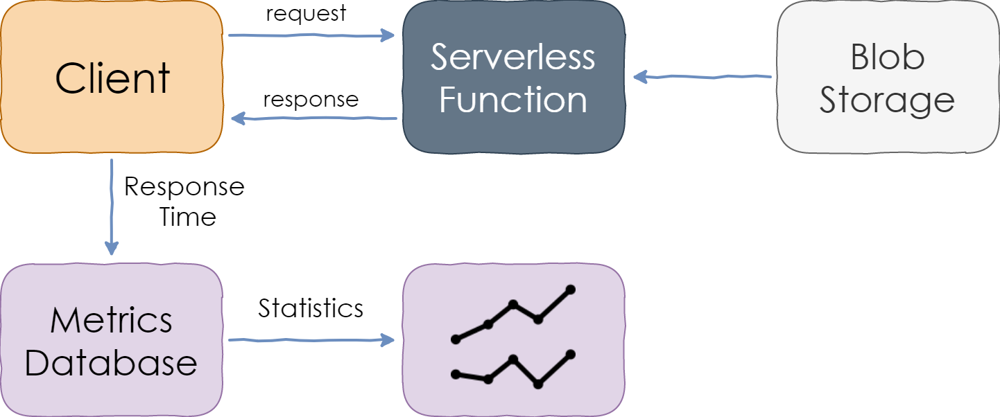

Measuring Response Time of a Serverless Function

I assume that Blob Storage services of each cloud providers are fast enough to serve 1 blob per request, and that latencies stay
constant over time and comparable to each other. I found that this is mostly true, except for one remark that you will see below.

Each measurement was then saved to a persistent storage and analyzed afterwards.

The charts below will show [percentile](https://en.wikipedia.org/wiki/Percentile) values. For instance, 95th percentile (written as P95)
value of 100 ms means that 95% of the requests were faster than 100 ms, while 5% were slower.

Load Pattern
------------

Not only did I want to test that serverless functions can serve 1000 requests per second, but I also wanted to make sure that
they can rapidly scale up to those volumes during the traffic increase.

The experiments starts with a baseline of 10% of target load. The goal of the baseline is to make sure that the app is overall healthy,
to evaluate the basic latency and the impact of Blob Storage on it.

At some point, the load then starts growing and reaches 1000 RPS within 7 minutes. After the peak, the cooldown period starts and
the load steadily decreases down to zero in 7 more minutes.

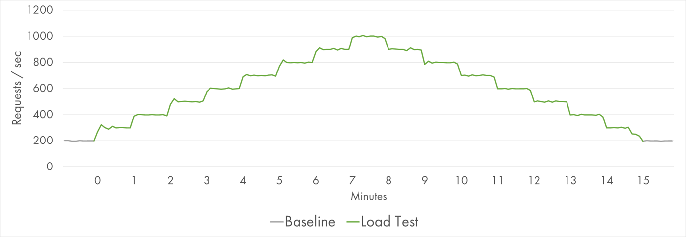

Request Distribution during the Load Test

Even though the growth period on the left and the decline period on the right process the same number of requests, the hypothesis is that
the first half might be more challenging because of the need to rapidly provision new resources.

In total, 600.000 requests are served within 15 minutes with the total traffic of 70 GB.

AWS Lambda
----------

Thank you for reading through all the mechanics, now it's time for the actual results.

The first target of the experiment was AWS Lambda. I provisioned 512 MB size for Lambda instances, which is a medium-size value.
I expect larger instances to be slightly faster, and smaller instances to be slightly slower, but the load is not very demanding
to CPU, so the overall results should be comparable.

During the low-load baseline, the median response time was about 70 ms with the minimum of 50 ms.

Here is the P50-P95 latency chart during the load test:

AWS Lambda Response Time Distribution (P50-P95)

It's very consistent and flat. The median response time is still around 70 ms with no variance observed. P90 and P95 are very
stable too. 

Only 99th percentile displays the difference between the ramp-up period on the left and cool-down period on the right:

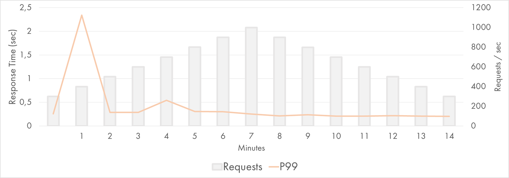

AWS Lambda Response Time Distribution (P50-P95)

AWS Lambda scales by creating multiple instances of the same function that handle the requests in parallel. Each Lambda instance
is handling a single request at any given time, that's why it's known as a "concurrent execution". When a request is processed,
the same instance can be reused for a subsequent request.

The following chart shows the amount of concurrent executions throughout the experiment:

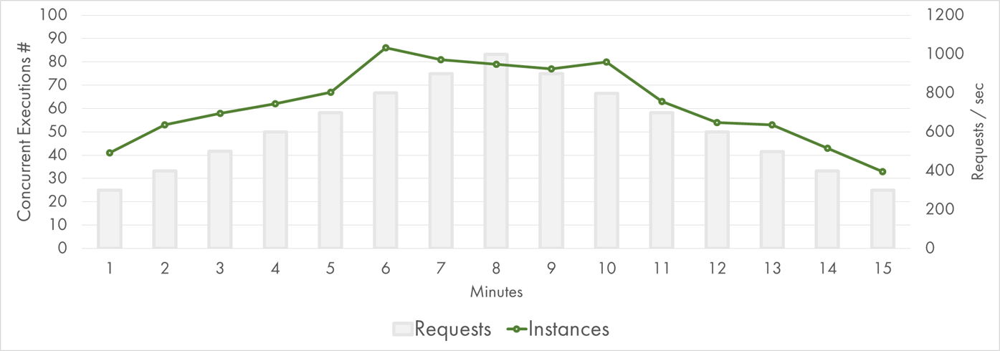

AWS Lambda Concurrent Executions

There are about 80 concurrent executions at peak. That's a lot, but still almost an order of magnitude less instances compared
to [my queue processing experiment](https://mikhail.io/2018/11/from-0-to-1000-instances-how-serverless-providers-scale-queue-processing/#crunching-numbers).
It feels that AWS is capapable to scale even further.

P99.9 shows slowness of the least lucky 0.1% requests. Most probably, it has lots of cold starts in it:

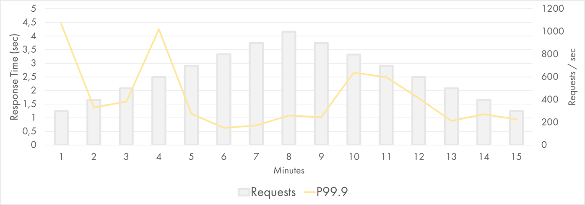

AWS Lambda Response Time Distribution (P99.9)

Still, even those requests are mostly served within 2-3 seconds.

Google Cloud Functions
----------------------

Now, let's look at the results of Google Cloud Functions. I provisioned 512 MB instance size, same as for Lambda.

During the low-load baseline, the median response time was about 150 ms with the minimum of 100 ms. That's an important observation because 
the values are twice bigger than ones of AWS. I haven't spent too much time investigating the reason, but my assumption is that Google
Cloud Storage has higher latency for small JSON files than S3. Zach Bjornson published [the comparison of storage latencies](http://blog.zachbjornson.com/2015/12/29/cloud-storage-performance.html).
Although it's 3 year old, the conclusion was that "GCS averaged more than three times higher latency" when compared to Azure and AWS.

Keeping this difference in mind, here is the P50-P95 latency chart during the GCP load test:

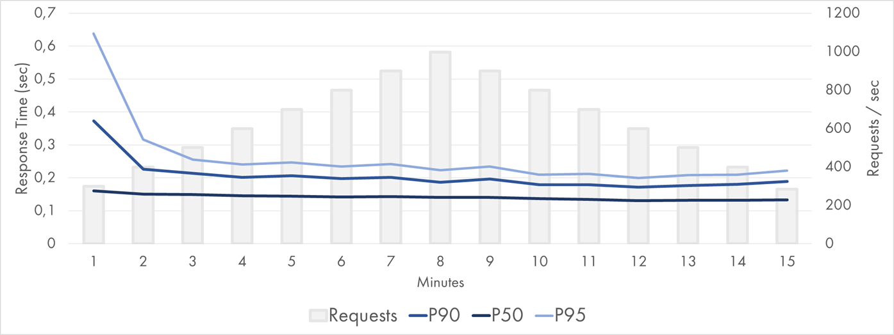

Google Cloud Function Response Time Distribution (P50-P95)

The median value is stable and flat at 140-160 ms. P90 and P95 had some spikes during the first 3 minutes. Google passed the test,
but even the lower percentiles are not perfect.

The 99th percentile is still solid though. It's higher on the left but it stays within 1 second most of the time:

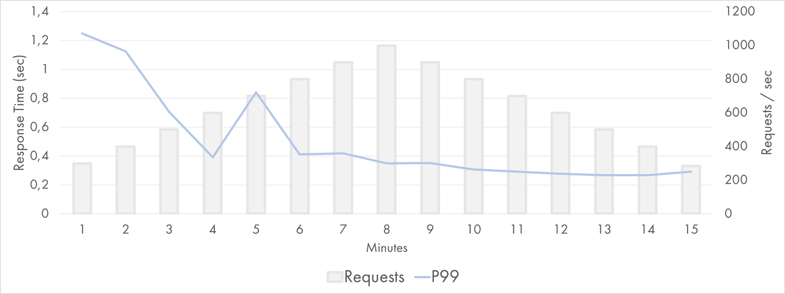

Google Cloud Function Response Time Distribution (P99)

The scaling model of Google Functions is very similar to the one of AWS Lambda. This means that 2x duration of an average execution
required 2x more concurrent executions to run and 2x more instances to be provisioned:

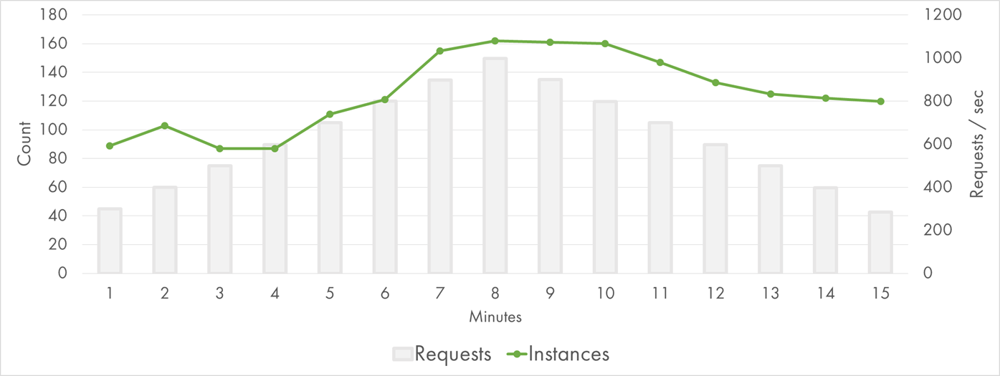

Google Cloud Function Response Time Distribution (P99.9)

Indeed, there are about 160 concurrent executions at peak. GCP had to work twice as hard because of the Storage latency, which might
explain some of the extra variation of response time.

In addition, Google seems to manage instance lifecycle in a different way. It provisioned a larger batch of instances during the first two minutes,
which is in line with [my previous findings](https://mikhail.io/2018/11/from-0-to-1000-instances-how-serverless-providers-scale-queue-processing/#pause-the-world-workload).
It also keeps instances for longer when the traffic goes down (or at least, reuses the alive instances more evenly).

For completeness, here are the P99.9 values:

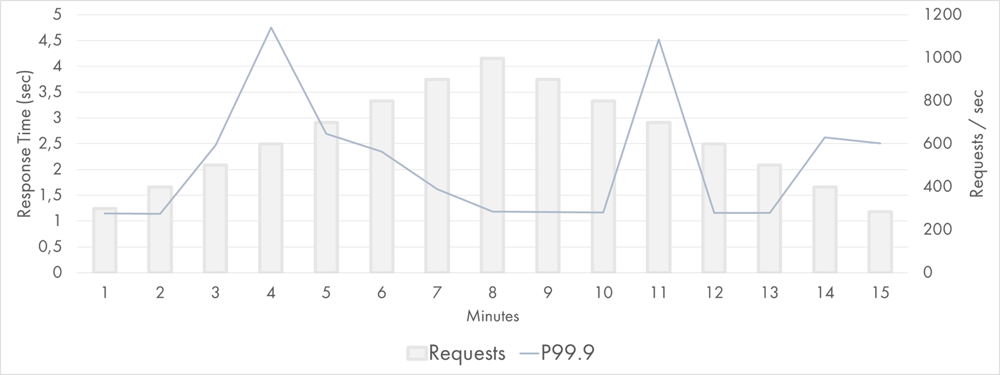

Google Cloud Function Response Time Distribution (P99.9)

It fluctuates between 1 and 5 seconds, interestingly, both on the left and on the right.

Azure
-----

Experiments with Azure Functions were run on 
[Consumption Plan](https://docs.microsoft.com/en-us/azure/azure-functions/functions-scale#consumption-plan)
&mdash;the dynamically scaled and billed-per-execution runtime. The concurrency model of Azure Functions 
is different from the counterparts of AWS/GCP.

During the low-load baseline, the median response time was about 95 ms with the minimum of 45 ms, which is close to AWS and
considerably faster than GCP.

However, it turns out that the scaling model doesn't work well for my experiment. Very high latencies were observed
during the Azure load test:

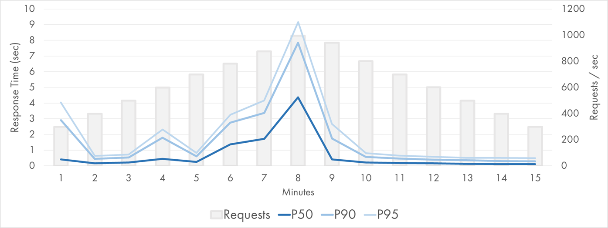

Azure Function (Node.js) Response Time Distribution (P50-P95)

Function App instance is closer to a VM than a single-task container. It runs multiple concurrent 
executions in parallel. A central coordinator called Scale Controller monitors the metrics from existing
instances and determines how many instances to provision on top.

This model didn't really help in terms of the total instances required to process the traffic:

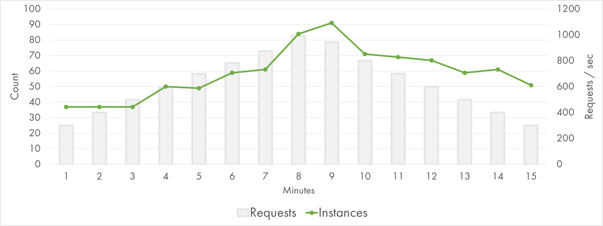

Azure Function (Node.js) Instances

90 instances were required at peak, which is almost exactly the same as the number of current executions of AWS Lambda.
Given I/O bound nature of my function, this fact is surprising to me. There seems to be an CPU-extensive part of the
workload somewhere in Azure Functions stack.

Puzzled by the moderate results, I decided to run the same application as a .NET Azure Function and compare the performance.
The same function ported to C# got much faster:

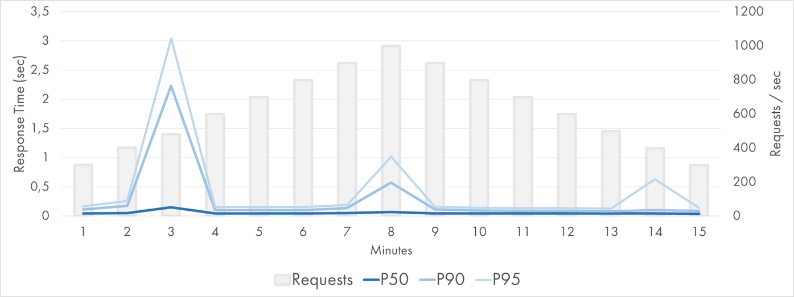

Azure Function (.NET) Response Time Distribution (P50-P95)

P50 is extremely good: it stays below 50 (!) ms for the whole period except for one point when it was 140 ms. P90 and
P95 are stable except three data points.

The chart of instance growth is very different from the JavaScript one too:

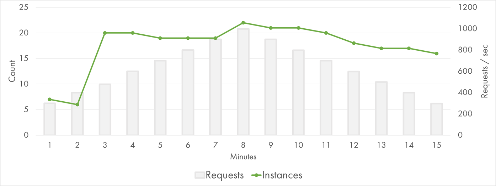

Azure Function (.NET) Instances

Basically, it went to 20 instances at third minute and that was enough for the rest of the test. I conclude that .NET worker
is more efficient compared to Node.js worker, at least for my scenario.

If I compare the percentile charts with the instance charts, it looks like the latency spikes happen at the time when new instances
get provisioned. For some reason, the performance suffers during the scale out. It's not just cold starts at the new instances:
P90 and even P50 are affected. Good topic for a separate investigation.

Conclusion
----------

During the experiment, sample StackOverflow pages were built and served from AWS Lambda, Google Cloud Functions and Azure Functions
at the rate of up to 1000 page views per second. Each Function call served one page view, and was a combination of I/O workload of
reading Blob Storage and CPU of parsing JSON and rendering HTML.

All cloud providers were able to scale up and serve the traffic. However, the latency distributions were quite different.

AWS Lambda was solid: median response time always below 100 ms, 95th percentile below 200ms, and 99th percentile was higher than
500 ms for just 1 minute.

Google Cloud Storage seems to have the highest latency out of three cloud providers. Google Cloud Functions had a bit of slowdown
during the first two minutes of the scale-out, but otherwise were quite stable and responsive.

Azure Functions had difficulties during the scale-out period with response time going up to several seconds. .NET worker appeared to
be more performant compared to Node.js one, but both of them show undesirable spikes when new instances are provisioned.

Here is my practical advice to take home:

- Function-as-a-Service is a great model to build applications that can work for low-usage scenarios, high-load applications, and
even spiky workloads

- Scalability limits do exist, so if you anticipate high growth in the application's usage, run a simple load test to see how
it behaves

- Always test in combination with your non-serverless dependencies. I've selected cloud blob storage, and yet I got some influence
of it on the end results. If you use a database or a third-party service, it's quite likely they will hit the scalability limit
much faster than the serverless compute.